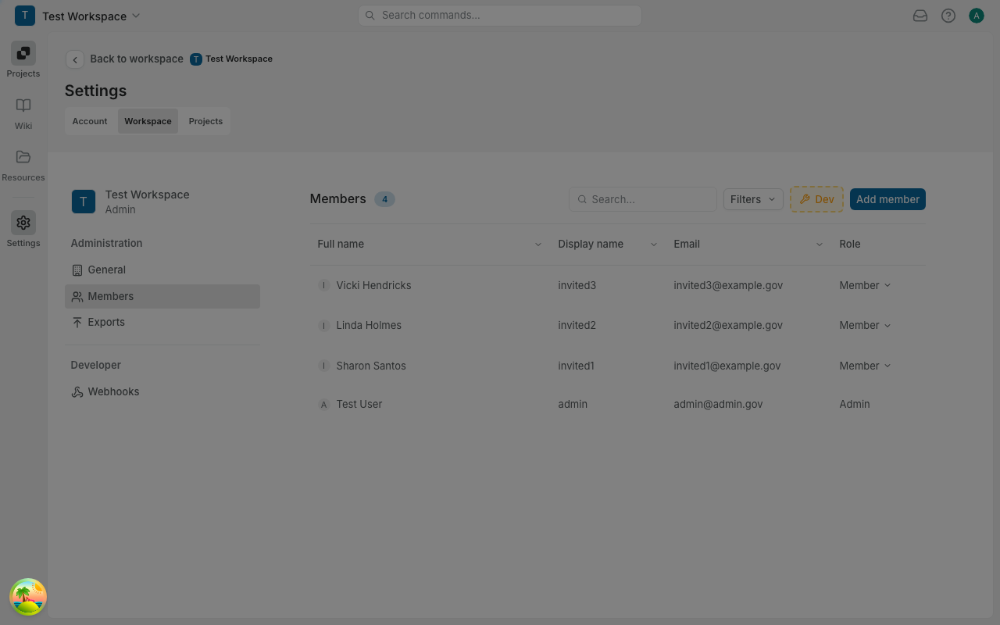
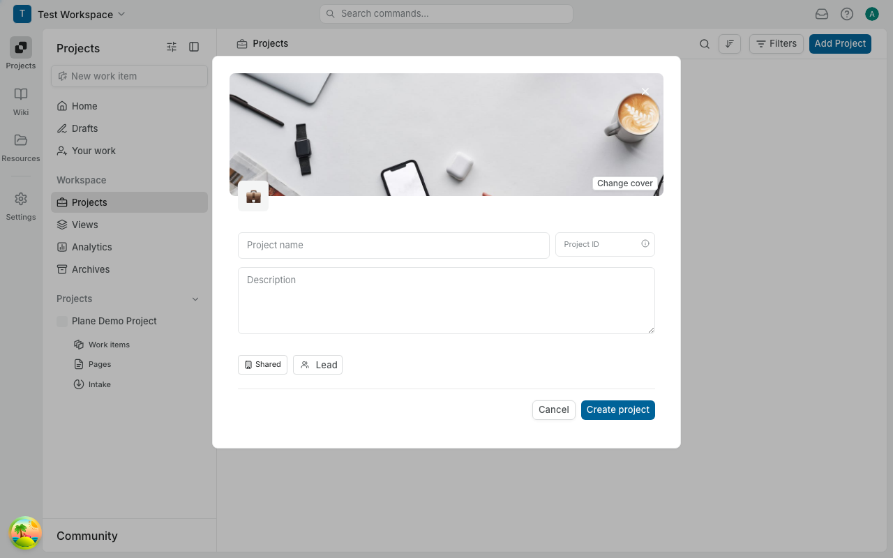

# Claude Work Handoff - Phase 8A: Dialog Migration

## Status: COMPLETE

All HeadlessUI `Dialog` + `Transition` components have been migrated to Radix `Dialog` from `@plane/propel/primitives`.

## Summary

- **35 files modified** across apps/web, apps/admin, apps/space, and packages/ui
- **0 remaining** HeadlessUI Dialog imports
- **Type check:** Passes (pre-existing i18n errors unrelated to migration)
- **Lint check:** Passes (pre-existing propel stories warnings unrelated to migration)

## Migration Pattern Applied

```tsx
// BEFORE (HeadlessUI)
import { Dialog, Transition } from "@headlessui/react";

<Transition appear show={isOpen} as={Fragment}>
  <Dialog as="div" onClose={handleClose}>
    <Transition.Child ...>
      <div className="fixed inset-0 bg-black/25" />
    </Transition.Child>
    <Dialog.Panel className="...">
      <Dialog.Title>Title</Dialog.Title>
      {children}
    </Dialog.Panel>
  </Dialog>
</Transition>

// AFTER (Radix)
import { Dialog, DialogContent, DialogOverlay, DialogPortal, DialogTitle } from "@plane/propel/primitives";

const handleOpenChange = (open: boolean) => {
  if (!open) handleClose();
};

<Dialog open={isOpen} onOpenChange={handleOpenChange}>
  <DialogPortal>
    <DialogOverlay />
    <div className="fixed inset-0 z-50 overflow-y-auto">
      <div className="flex items-center justify-center p-4">
        <DialogContent showCloseButton={false} className="... static translate-x-0 translate-y-0 p-0 border-0">
          <DialogTitle>Title</DialogTitle>
          {children}
        </DialogContent>
      </div>
    </div>
  </DialogPortal>
</Dialog>
```

## Files Migrated

### Core UI Package (1 file)

- [x] `packages/ui/src/modals/modal-core.tsx`

### Core Modals (6 files)

- [x] `apps/web/core/components/core/modals/bulk-delete-issues-modal.tsx`
- [x] `apps/web/core/components/core/modals/existing-issues-list-modal.tsx`
- [x] `apps/web/core/components/core/modals/user-image-upload-modal.tsx`
- [x] `apps/web/core/components/core/modals/change-email-modal.tsx`
- [x] `apps/web/core/components/core/modals/workspace-image-upload-modal.tsx`
- [x] `apps/web/core/components/core/filters/date-filter-modal.tsx`

### Workspace Modals (4 files)

- [x] `apps/web/core/components/workspace/confirm-workspace-member-remove.tsx`
- [x] `apps/web/core/components/workspace/ConfirmWorkspaceMemberRemove.tsx`
- [x] `apps/web/core/components/workspace/invite-modal/form.tsx`
- [x] `apps/web/core/components/workspace-notifications/sidebar/notification-card/options/snooze/modal.tsx`

### Project Modals (6 files)

- [x] `apps/web/core/components/project/leave-project-modal.tsx`
- [x] `apps/web/core/components/project/delete-project-modal.tsx`
- [x] `apps/web/core/components/project/join-project-modal.tsx`
- [x] `apps/web/core/components/project/send-project-invitation-modal.tsx`
- [x] `apps/web/core/components/project/confirm-project-member-remove.tsx`
- [x] `apps/web/core/components/project/settings/archive-project/archive-restore-modal.tsx`

### Issue Modals (3 files)

- [x] `apps/web/core/components/issues/confirm-issue-discard.tsx`
- [x] `apps/web/core/components/issues/archive-issue-modal.tsx`
- [x] `apps/web/core/components/issues/parent-issues-list-modal.tsx`

### Inbox Modals (2 files)

- [x] `apps/web/core/components/inbox/modals/snooze-issue-modal.tsx`
- [x] `apps/web/core/components/inbox/modals/select-duplicate.tsx`

### Sprint/Epic Modals (3 files)

- [x] `apps/web/core/components/sprints/transfer-issues-modal.tsx`
- [x] `apps/web/core/components/sprints/archived-sprints/modal.tsx`
- [x] `apps/web/core/components/epics/archived-epics/modal.tsx`

### Other Modals (7 files)

- [x] `apps/web/core/components/onboarding/switch-account-modal.tsx`
- [x] `apps/web/core/components/integration/delete-import-modal.tsx`
- [x] `apps/web/core/components/exporter/export-modal.tsx`
- [x] `apps/web/core/components/automation/select-month-modal.tsx`
- [x] `apps/web/core/components/power-k/ui/modal/wrapper.tsx`
- [x] `apps/web/core/components/power-k/ui/modal/shortcuts-root.tsx`
- [x] `apps/web/core/components/account/deactivate-account-modal.tsx`

### Admin/Space Apps (3 files)

- [x] `apps/admin/core/components/common/confirm-discard-modal.tsx`
- [x] `apps/admin/app/(all)/(dashboard)/email/test-email-modal.tsx`
- [x] `apps/space/core/components/issues/peek-overview/layout.tsx`

## Special Cases Handled

1. **Export Modal (`export-modal.tsx`):** Has `isSelectOpen` state that needs to prevent closing when select dropdown is open

   ```tsx
   const handleOpenChange = (open: boolean) => {
     if (!open && !isSelectOpen) handleClose();
   };
   ```

2. **Peek Overview (`layout.tsx`):** Has two separate dialogs - side peek (slide animation) and modal peek (centered with overlay)

3. **Combobox Components:** Kept HeadlessUI `Combobox` imports as they are out of scope for Phase 8A

## Remaining HeadlessUI Components

The following HeadlessUI components are still in use and will be addressed in future phases:

- `Combobox` - Autocomplete dropdowns
- `Popover` - Popovers
- `Tab` - Tab panels
- `Disclosure` - Expandable sections
- `Menu` - Dropdown menus
- `Switch` - Toggle switches
- `Listbox` - Select dropdowns
- `Transition` - Animations (for non-Dialog uses)

## Context

- **Created:** 2025-12-24
- **Completed:** 2025-12-24
- **Branch:** phase-8a-dialog-migration
- **Base:** master
- **Worktree:** /Users/corcoss/code/plane-gov/.worktrees/phase-8a-dialog-migration

## Visual Verification

Screenshots captured showing Radix Dialog components working correctly:

### Invite Member Dialog (ModalCore-based)



The invite member dialog uses `ModalCore` which wraps Radix Dialog primitives. This dialog demonstrates:
- Proper centered positioning with backdrop overlay
- Email input field with role dropdown
- Cancel and action buttons
- Escape key closes the dialog ✅

### Create Project Dialog (Direct DialogContent)



The create project dialog uses Radix `DialogContent` directly with position overrides. This demonstrates:
- Cover image with change option
- Form inputs (name, ID, description)
- Shared/Lead options
- Cancel and Create buttons
- Proper overlay rendering
- Escape key closes the dialog ✅

All dialogs render correctly with proper overlay, animations, and keyboard navigation.

## Bugs Fixed During Migration

1. **Missing `handleClose` prop**: Several modals weren't passing `handleClose` to `ModalCore`, preventing Escape key from closing dialogs. Fixed in:
   - `apps/web/ce/components/workspace/members/invite-modal.tsx`
   - `apps/web/core/components/estimates/delete/modal.tsx`
   - `apps/web/core/components/estimates/create/modal.tsx`
   - `apps/web/core/components/sprints/modal.tsx`
   - `apps/web/core/components/epics/modal.tsx`
   - `apps/web/core/components/views/modal.tsx`

2. **Dialog visibility bug**: `ModalCore` needed proper position override classes when using propel's `DialogContent`. The fix adds `static translate-x-0 translate-y-0 p-0 border-0` to override `DialogContent`'s default fixed positioning, allowing the flex centering from parent wrapper to work correctly. This matches the pattern used by other dialogs in the codebase.

## Reference Files

- Migration plan: `plans/shadcn-cleanup-headlessui-removal.md`
- Existing Radix Dialog: `packages/propel/src/primitives/dialog.tsx`
- packages/ui modal: `packages/ui/src/modals/modal-core.tsx`
